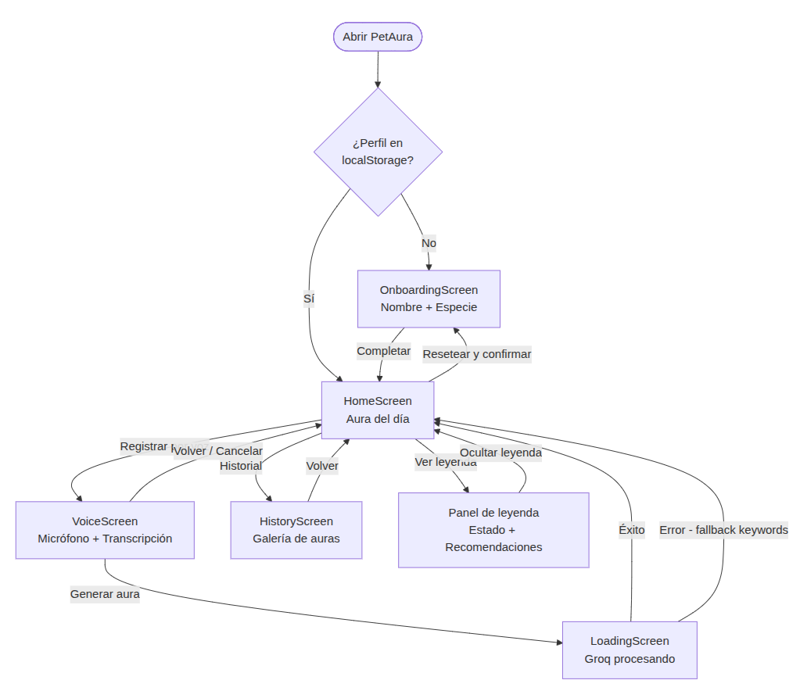
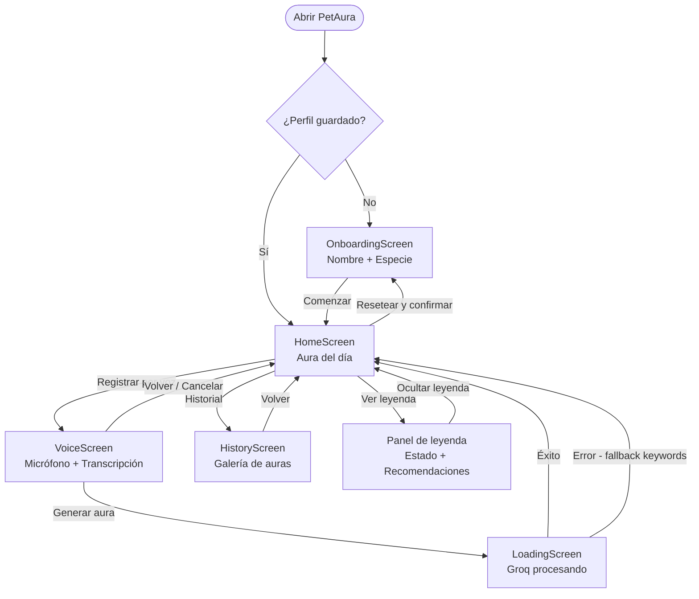

# PetAura — MVP (PC02)

PetAura es una Progressive Web App que genera una visualización generativa única —un "aura" de partículas animadas— que representa el estado emocional diario de una mascota. El dueño describe cómo estuvo su mascota mediante **voz** o **texto**, y la app traduce ese relato en parámetros visuales que el sistema de partículas convierte en una experiencia viva e irrepetible.

**Curso:** CC451 Interacción Humano Computador  
**Semestre:** 2026-1  
**Equipo:** Matias Vilca · Diego Delgado · Dery Gonzales

---

## Diagrama de navegación





---

## Pantallas del MVP

| Pantalla | Descripción |
|---|---|
| **OnboardingScreen** | Primera vez — aura latente CSS, registro de nombre y especie |
| **HomeScreen** | Aura del día, panel de leyenda, recomendaciones, acceso a voz e historial |
| **VoiceScreen** | Grabación con Web Speech API, transcripción en tiempo real, amplitud visual |
| **LoadingScreen** | Animación expectante mientras Groq procesa el relato |
| **HistoryScreen** | Galería cronológica de auras pasadas desde localStorage |

---

## Flujo técnico

1. El usuario describe cómo estuvo su mascota por **voz** (Web Speech API) o **texto**.
2. El frontend envía `{ profile, transcript }` al backend Express vía proxy Vite (`/api/analyze`).
3. El backend agrega la clave `GROQ_API_KEY` desde `backend/.env` y llama al endpoint OpenAI-compatible de Groq.
4. Groq devuelve un JSON con `mood`, `energy`, `stress`, `warmth`, `pattern`, `summary` y `actions`.
5. El Canvas 2D renderiza el aura con las partículas animadas según los parámetros recibidos.
6. El aura y sus metadatos se guardan en `localStorage` como historial de la mascota.

---

## Configuración y ejecución local

### 1. Instalar dependencias

```bash
# Raíz del proyecto
npm install

# Backend
cd backend && npm install
```

### 2. Configurar la clave de Groq

```bash
cp backend/.env.example backend/.env
```

Editar `backend/.env`:

```env
GROQ_API_KEY=tu_clave_groq_aqui
PORT=3001
```

La clave gratuita se obtiene en [console.groq.com](https://console.groq.com).

### 3. Iniciar el proyecto (dos terminales)

```bash
# Terminal 1 — backend
cd backend && npm run dev

# Terminal 2 — frontend
npm run dev
```

### 4. Abrir la aplicación

Visitar `http://localhost:5173` en **Chrome** (requerido para Web Speech API).

---

## Estructura del repositorio

```
petaura-mvp/
├── src/
│   ├── App.jsx                        # Navegación entre pantallas y lógica principal
│   ├── components/
│   │   ├── AuraCanvas.jsx             # Motor de partículas Canvas 2D (4 patrones)
│   │   ├── OnboardingScreen.jsx       # Registro inicial con aura latente CSS
│   │   ├── VoiceScreen.jsx            # Grabación Web Speech API + amplitud visual
│   │   ├── LoadingScreen.jsx          # Animación expectante mientras procesa Groq
│   │   └── HistoryScreen.jsx          # Galería de historial desde localStorage
│   ├── services/
│   │   └── groqService.js             # Cliente que llama al backend /api/analyze
│   └── ai/
│       └── analyzeTranscript.js       # Normalización y fallback por keywords
├── backend/
│   ├── server.js                      # Proxy Express → Groq API
│   ├── .env.example                   # Plantilla de variables de entorno
│   └── .gitignore                     # Protege backend/.env del repositorio
├── images/                            # Capturas de pantalla para el reporte PC02
├── docs/                              # Documentación del proyecto
└── vite.config.js                     # Proxy /api → localhost:3001
```

---

## Tecnologías

| Capa | Tecnología |
|---|---|
| Frontend | React 18 + Vite + CSS puro |
| Aura / partículas | HTML5 Canvas 2D |
| Entrada de voz | Web Speech API (Chrome) |
| Amplitud de audio | Web Audio API |
| LLM | Groq API — `llama3-8b-8192` |
| Backend proxy | Express + dotenv + cors |
| Persistencia | localStorage |
| Háptica | Vibration API |

---

## Notas

- La API key de Groq nunca se expone en el cliente. Todas las llamadas al LLM pasan por el backend.
- Si el navegador no soporta Web Speech API o el backend no está disponible, el sistema cae a detección por palabras clave y sigue funcionando.
- El perfil de mascota y el historial de auras persisten en `localStorage` entre sesiones.

## Licencia

MIT — ver [LICENSE](LICENSE).
