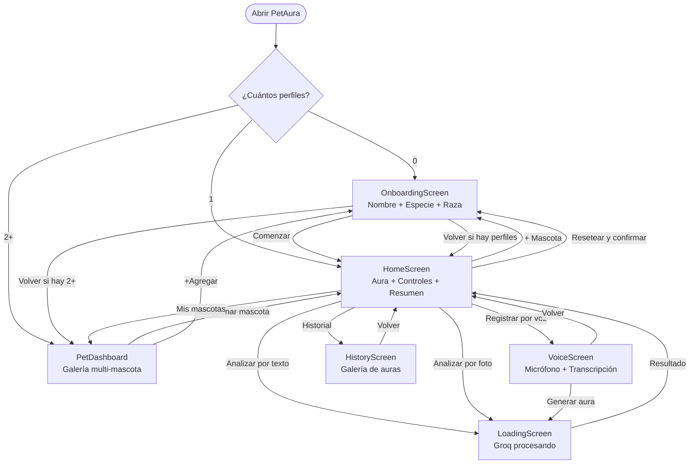

# PetAura — MVP

PetAura es una Progressive Web App que genera una visualización generativa única —un "aura" de partículas animadas— que representa el estado emocional de una mascota. El dueño describe cómo estuvo su mascota mediante **voz**, **texto** o **foto**, y la app traduce ese input en parámetros visuales que el motor de partículas Canvas 2D convierte en una experiencia viva e irrepetible. Soporta **múltiples mascotas** con perfiles independientes, historial por mascota y avatar editable.

**Curso:** CC451 Interacción Humano Computador  
**Semestre:** 2026-1  
**Equipo:** Mathias Vilca · Diego Delgado · Dery Gonzales

---

## Diagrama de navegación


```mermaid
flowchart TD
    A([Abrir PetAura]) --> B{¿Cuántos perfiles?}

    B -->|0| C[OnboardingScreen\nNombre + Especie + Raza]
    B -->|1| D[HomeScreen\nAura + Controles + Resumen]
    B -->|2+| E[PetDashboard\nGalería multi-mascota]

    C -->|Comenzar| D
    C -->|Volver si hay perfiles| D
    C -->|Volver si hay 2+| E

    E -->|Seleccionar mascota| D
    E -->|+Agregar| C

    D -->|Registrar por voz| F[VoiceScreen\nMicrófono + Transcripción]
    D -->|Analizar por texto| G[LoadingScreen\nGroq procesando]
    D -->|Analizar por foto| G
    D -->|Historial| H[HistoryScreen\nGalería de auras]
    D -->|Mis mascotas| E
    D -->|+ Mascota| C
    D -->|Resetear y confirmar| C

    F -->|Generar aura| G
    F -->|Volver| D

    G -->|Resultado| D

    H -->|Volver| D
```

---

## Pantallas del MVP

| Pantalla | Descripción |
|---|---|
| **OnboardingScreen** | Registro de mascota (nombre, especie, raza opcional) con aura latente CSS. Botón de volver condicional: sin mascotas → sin botón; 1 mascota → vuelve a Home; 2+ → vuelve a Dashboard |
| **PetDashboard** | Galería multi-mascota con mini-auras animadas (72px), badges de alerta (anxious/irritable/health_concern), búsqueda por nombre y botón +Agregar |
| **HomeScreen** | Layout de dos columnas en desktop: izquierda (avatar + controles + resumen + recomendaciones) / derecha (aura grande sticky + leyenda). Colapsa a una columna en móvil |
| **VoiceScreen** | Grabación con Web Speech API (es-ES, continuo), transcripción en tiempo real, amplitud visual con Web Audio API, edición del transcript antes de enviar |
| **LoadingScreen** | Animación expectante mientras Groq procesa el relato o la foto |
| **HistoryScreen** | Galería cronológica filtrada por mascota activa, mini-auras animadas de 64px con IntersectionObserver, panel expandible con summary y acciones |

### Componentes auxiliares

| Componente | Descripción |
|---|---|
| **AuraCanvas** | Motor de partículas Canvas 2D con 4 patrones (flow, orbit, pulse, burst), jitter circular por stress, opacidad por warmth, partículas bicolor 25% |
| **PhotoAnalysisMenu** | Acordeón: captura/selección de foto, compresión a 800px JPEG 80%, contexto textual opcional, extracción de base64 puro |
| **NavBackButton** | Botón de volver reutilizable, consistente en todas las pantallas |
| **PayloadInjector** | Herramienta de desarrollo: inyecta JSON crudo del LLM para probar moods sin backend |

---

## Flujo técnico

### Análisis por voz/texto

1. El usuario describe cómo estuvo su mascota por **voz** (Web Speech API) o **texto**.
2. El frontend envía `{ profile, transcript }` al backend Express vía proxy Vite (`/api/analyze`).
3. El backend agrega `GROQ_API_KEY` desde `.env` y llama a Groq con `llama-3.1-8b-instant` (temp 0.3, max_tokens 600).
4. Groq devuelve JSON: `{ mood, mood_secondary, energy, stress, warmth, health_concern, summary, actions }`.
5. `normalizeAuraPayload()` valida y clampea los valores. `applyAnalysisResult()` hace merge con `mockStates[mood]` para derivar color y patrón.
6. AuraCanvas re-renderiza con los nuevos parámetros. El historial se guarda en localStorage.

### Análisis por foto

1. El usuario toma/selecciona una foto desde **PhotoAnalysisMenu**.
2. El componente comprime a ≤800px JPEG 80% y extrae el base64 puro (`split(',')[1]`).
3. El frontend envía `{ imageBase64, mimeType, profileText, contextText }` al backend (`/api/analyze-photo`).
4. El backend llama a Groq con `llama-4-scout-17b-16e-instruct` (visión, temp 0.3, max_tokens 800).
5. El prompt incluye un bloque condicional de raza con jerarquía: imagen > contexto > raza.
6. Misma cadena de normalización y aplicación que el flujo de texto.

### Fallbacks

- Si el backend falla en **texto**: `keywordAnalyzeTranscript()` hace análisis por regex.
- Si el backend falla en **foto**: cae a `mockStates[MOODS.CALM]` con mensaje de error.

---

## Configuración y ejecución local

### 1. Instalar dependencias

```bash
# Raíz del proyecto
npm install

# Backend
cd backend && npm install
```

### 2. Configurar la clave de Groq

```bash
cp backend/.env.example backend/.env
```

Editar `backend/.env`:

```env
GROQ_API_KEY=tu_clave_groq_aqui
PORT=3001
```

La clave gratuita se obtiene en [console.groq.com](https://console.groq.com).

### 3. Iniciar el proyecto (dos terminales)

```bash
# Terminal 1 — backend
cd backend && npm run dev

# Terminal 2 — frontend
npm run dev
```

### 4. Abrir la aplicación

Visitar `http://localhost:5173` en **Chrome** (requerido para Web Speech API).

---

## Estructura del repositorio

```
petaura-mvp/
├── src/
│   ├── App.jsx                        # Navegación, estado global, Home screen (layout dos columnas)
│   ├── moods.js                       # MOODS enum, COLORS_MOOD, MOOD_ES, mockStates
│   ├── components/
│   │   ├── AuraCanvas.jsx             # Motor de partículas Canvas 2D (4 patrones, jitter, warmth→opacidad)
│   │   ├── OnboardingScreen.jsx       # Registro con aura latente CSS y NavBackButton condicional
│   │   ├── PetDashboard.jsx           # Galería multi-mascota con mini-auras y badges de alerta
│   │   ├── VoiceScreen.jsx            # Grabación Web Speech API + amplitud visual
│   │   ├── LoadingScreen.jsx          # Animación expectante mientras procesa Groq
│   │   ├── HistoryScreen.jsx          # Galería filtrada por mascota con mini-auras 64px
│   │   ├── PhotoAnalysisMenu.jsx      # Captura de foto, compresión, base64, contexto opcional
│   │   ├── NavBackButton.jsx          # Botón de volver reutilizable
│   │   └── PayloadInyector.jsx        # Dev tool: inyecta JSON crudo para testing
│   ├── services/
│   │   └── groqService.js             # Cliente HTTP: generateAura() + generateAuraFromPhoto()
│   └── ai/
│       └── analyzeTranscript.js       # Orquesta LLM + fallback por keywords
├── backend/
│   ├── server.js                      # Express: /api/analyze (texto) + /api/analyze-photo (visión)
│   ├── .env.example                   # Plantilla de variables de entorno
│   └── .gitignore                     # Protege backend/.env del repositorio
├── docs/                              # Documentación técnica del proyecto
├── images/                            # Capturas de pantalla para el reporte
└── vite.config.js                     # Proxy /api → localhost:3001
```

---

## Tecnologías

| Capa | Tecnología |
|---|---|
| Frontend | React 18 + Vite + CSS puro |
| Aura / partículas | HTML5 Canvas 2D (requestAnimationFrame + IntersectionObserver) |
| Entrada de voz | Web Speech API (Chrome, es-ES) |
| Amplitud de audio | Web Audio API |
| Análisis por foto | Compresión canvas + base64 |
| LLM texto | Groq API — `llama-3.1-8b-instant` |
| LLM visión | Groq API — `llama-4-scout-17b-16e-instruct` |
| Backend proxy | Express + dotenv + cors (body limit 10mb) |
| Persistencia | localStorage (perfiles, historial, racha, avatar, preferencias) |
| Háptica | Vibration API |
| Síntesis de voz | Web Speech Synthesis API |

---

## Notas

- La API key de Groq nunca se expone en el cliente. Todas las llamadas al LLM pasan por el backend.
- Si el navegador no soporta Web Speech API o el backend no está disponible, el sistema cae a detección por palabras clave (texto) o aura calm genérica (foto).
- Soporta **múltiples mascotas** con perfiles independientes (`petaura_profiles`), historial filtrado por `petId` y perfil activo persistente.
- El **avatar** de mascota se comprime a 80×80px JPEG y se persiste en localStorage como parte del perfil (~2-3 KB por avatar).
- El análisis por foto comprime la imagen a ≤800px antes de enviar. El `split(',')[1]` sobre `canvas.toDataURL()` es crítico para evitar data URIs duplicados.
- `health_concern` es un canal de salud ortogonal a la emoción: una mascota puede estar `playful` con `health_concern: true` si hay síntoma físico visible.
- El layout del Home es de **dos columnas** en desktop (≥768px) con el aura sticky a la derecha. En móvil colapsa a una columna.

## Licencia

MIT — ver [LICENSE](LICENSE).
